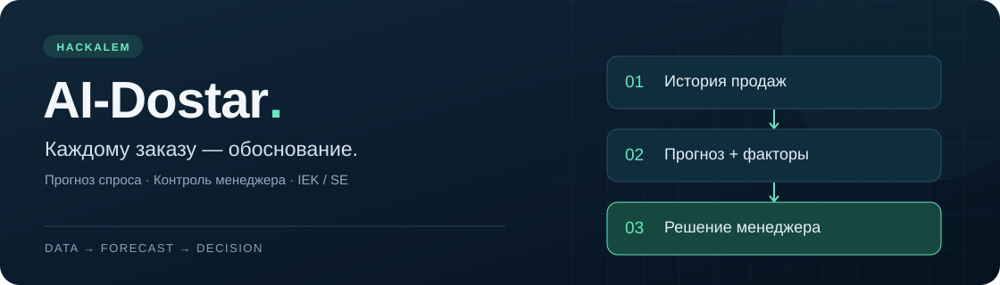
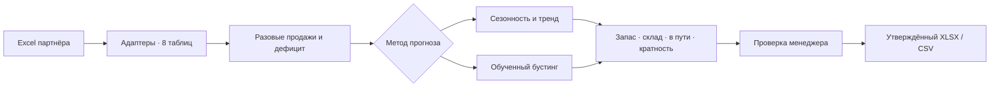

<div align="center">



**Помощник закупщика, который показывает, сколько заказать и почему.**

Кейс «Электрокомплект» · HackAlem · IEK & Systeme Electric


[Запуск](#быстрый-запуск) · [Деплой](#деплой-в-интернет) · [Возможности](#шесть-экранов-один-процесс-закупки) · [ML](#два-метода-прогноза) · [Демо](docs/demo.md) · [Проверки системы](docs/system-verification.md) · [Документация](#документация-и-команда)

</div>

---

## Закупка начинается с понимания спроса

Большая продажа может оказаться разовым проектом. Низкие продажи — следствием пустого склада. Сезонный рост легко перепутать с постоянным, а уже заказанный товар — не учесть в новой закупке.

**AI-Dostar превращает Excel-выгрузки в проверяемую рекомендацию:** выделяет регулярный спрос, оценивает влияние дефицита, строит прогноз и рассчитывает заказ с учётом склада, поставок в пути и кратности упаковки. Менеджер видит факторы расчёта, вносит правки и утверждает итог.

> **Рекомендация → объяснение → решение менеджера → файл заказа.**
> Отправка поставщику остаётся за человеком.

### На реальных данных партнёра

| Строк накладных | Товаров в каталоге | Поставщиков | Строк расчёта менеджера SE |
|:---:|:---:|:---:|:---:|
| **248 875** | **3 667** | **2** | **497** |

Дата расчёта по умолчанию — последняя продажа в наборе, **22 сентября 2026 года**. Это историческая выгрузка, не подключение к живому складу.

## Шесть экранов, один процесс закупки

| Экран | Что получает менеджер |
|---|---|
| **Заказ** | Рекомендации по поставщику, фильтры, срочность, правка количества с причиной, утверждение и экспорт. |
| **Товар** | Историю всего каталога, разовые продажи и дефицит на графике, прогноз, кратность и объяснение расчёта. |
| **Проверки** | Семь сценариев: все факторы, отключение каждого из пяти факторов и дополнительный товар в пути. |
| **Сравнение с менеджером** | Средние фактические продажи и регулярный спрос за 12 полных месяцев рядом с расчётом SE. |
| **Разовые заказы** | Конкретные накладные: исходный объём, типичное количество, исключённая часть и причина. |
| **Ассистент** | Рекомендации по заказу, поиск обычными словами, рекомендации по заказу, новинки, угасающий спрос и кандидатов на замену товара. |

В боковой панели настраиваются метод прогноза, сроки поставки, период пересмотра, уровень сервиса, рост категорий и факторы спроса. Новый расчёт запускается кнопкой **«Рассчитать»**.

### 🤖 «Спросить ассистента» — над всеми вкладками

После расчёта первой на странице стоит панель **«Спросить ассистента»**: поле для вопроса своими словами, кнопка «Спросить» и готовые примеры-кнопки («Какие позиции IEK заказать в первую очередь и почему?», «Почему по трубе гибкой Ø50 такой большой заказ?», «Дай сводку по заказу Systeme Electric», «Что сделать с этим заказом?», «Какие товары выходят из ассортимента…»). ChatGPT понимает вопрос и выбирает намерение и фильтр по строгой JSON-схеме; **ответ и все количества формирует приложение из текущего расчёта** — модель не пишет чисел. Под ответом — источник и таблица строк заказа, на которых он основан. После правки количества или пересчёта старый ответ скрывается. Без ключа вопрос разбирается по правилам.

**«Покажи критичные УЗО у IEK, где был дефицит»** — ассистент превращает запрос в фильтр по рассчитанному заказу. Без API-ключа работает разбор по правилам. Кандидаты «старая модель → новая» остаются гипотезами для проверки: похожее название не подтверждает замену. [Методика ассистента](docs/methodology-assistant.md).

> **Версии:** тег `v1.0.0` — первая готовая версия ([docs/RELEASE.md](docs/RELEASE.md)). Текущий `main` дополнительно содержит: панель «Спросить ассистента» над вкладками; ответы ассистента из данных расчёта (без свободного текста модели), подсчёт до ограничения выдачи и учёт поставщика в рекомендациях; объединённую ветку `ml/demand-forecast` — Jupyter-разбор модели, наглядный ML-гайд и отчёт о полной проверке системы (см. ниже).

## Быстрый запуск

Нужны **Python 3.12+**, Git и доступ к репозиторию. Команды выполняются из его корня; OpenAI API-ключ для расчёта и интерфейса не требуется.

### Windows · PowerShell

```powershell
git clone https://github.com/BAITC-Hacks/hack-1404e13c-ai-dostar.git
cd hack-1404e13c-ai-dostar
python -m venv .venv
.venv\Scripts\python.exe -m pip install -r requirements.txt
.venv\Scripts\python.exe -m app.adapters.build --raw datasets
.venv\Scripts\python.exe -m streamlit run app/ui/app.py
```

Откройте **[localhost:8501](http://localhost:8501)** и нажмите **«Рассчитать»**. Статистический метод доступен сразу после сборки данных.

<details>
<summary><strong>Linux / macOS</strong></summary>

```bash
git clone https://github.com/BAITC-Hacks/hack-1404e13c-ai-dostar.git
cd hack-1404e13c-ai-dostar
python3 -m venv .venv
.venv/bin/python -m pip install -r requirements.txt
.venv/bin/python -m app.adapters.build --raw datasets
.venv/bin/python -m streamlit run app/ui/app.py
```

Используйте Python 3.12 или новее. В последующих командах заменяйте `.venv\Scripts\python.exe` на `.venv/bin/python`.

</details>

Исходные книги лежат в `datasets/IEK` и `datasets/Systeme electric`. Сборка создаёт восемь таблиц Parquet в `data/clean/`. Рабочий интерфейс использует реальные данные; при отсутствии таблиц показывает инструкцию по сборке. Для собственных распакованных архивов можно указать `--raw data/raw`.

## Деплой в интернет

### Streamlit Community Cloud — ссылка для демонстрации

Понадобятся GitHub-аккаунт с доступом к этому репозиторию и [Streamlit Community Cloud](https://share.streamlit.io/). Публикуйте ветку `main`: исправления ассистента после релиза не входят в тег `v1.0.0`.

**1. Подготовьте стартовый файл.** Облако устанавливает `requirements.txt`, но не выполняет команду сборки Excel автоматически. `data/clean/` и `data/models/` исключены из Git, поэтому одного запуска `app/ui/app.py` на чистом сервере недостаточно.

Создайте **`streamlit_app.py` в корне репозитория** со следующим содержимым. Это пример для добавления перед деплоем; готового файла в текущей версии нет.

```python
import os
import runpy
import subprocess
import sys
from pathlib import Path

import streamlit as st

ROOT = Path(__file__).resolve().parent


@st.cache_resource(show_spinner="Подготовка данных для демонстрации…")
def prepare(build_ml: bool):
    subprocess.run(
        [sys.executable, "-m", "app.adapters.build", "--raw", "datasets"],
        cwd=ROOT, check=True,
    )
    if build_ml:
        subprocess.run(
            [sys.executable, "-m", "app.ml.train"], cwd=ROOT, check=True,
        )
    return True


prepare(os.environ.get("BUILD_ML", "0") == "1")
runpy.run_path(str(ROOT / "app/ui/app.py"), run_name="__main__")
```

Подготовка кешируется между сессиями и повторными запусками страницы в одном процессе. После перезапуска сервера данные собираются заново. При обновлении Excel в `datasets/` перезагрузите приложение через **Reboot**, чтобы очистить кеш подготовки.

Проверьте запуск локально и отправьте новый файл в ветку деплоя:

```powershell
.venv\Scripts\python.exe -m streamlit run streamlit_app.py
# После проверки остановите сервер сочетанием Ctrl+C.
git add streamlit_app.py
git commit -m "deploy: add Streamlit Cloud entrypoint"
git push origin main
```

**2. Создайте приложение.** В Community Cloud нажмите **Create app**, подключите GitHub и заполните:

| Поле | Значение |
|---|---|
| Repository | `BAITC-Hacks/hack-1404e13c-ai-dostar` или ваш fork |
| Branch | `main` |
| Main file path | `streamlit_app.py` |
| Advanced settings → Python version | `3.12` |
| App URL | Свободное имя, например `ai-dostar-demo` |

При необходимости предоставьте Streamlit доступ к репозиторию организации. После **Deploy** сервис выдаст HTTPS-ссылку вида `https://<выбранное-имя>.streamlit.app`. Подробности полей — в [официальной инструкции Streamlit](https://docs.streamlit.io/deploy/streamlit-community-cloud/deploy-your-app/deploy).

**3. Настройте ИИ и ML.** Для первого запуска достаточно статистического метода без API-ключа. В **Advanced settings → Secrets** можно задать:

```toml
COPILOT_ENABLED = "0"
BUILD_ML = "0"
```

Чтобы включить ИИ, замените настройки на следующие и подставьте свой ключ непосредственно в панели облака:

```toml
OPENAI_API_KEY = "ваш-ключ"
OPENAI_MODEL = "gpt-4o-mini"
COPILOT_ENABLED = "1"
BUILD_ML = "0"
```

Параметры задаются **на верхнем уровне TOML, без секции `[openai]`**: приложение читает переменные окружения, а Streamlit экспортирует в них корневые значения Secrets. Не добавляйте ключ в стартовый файл или Git. См. [управление секретами Streamlit](https://docs.streamlit.io/develop/concepts/connections/secrets-management).

Для ML установите `BUILD_ML = "1"` и перезагрузите приложение. Стартовый файл обучит модель в том же окружении и на тех же таблицах, где она будет использоваться. Обучение увеличивает время старта и потребление ресурсов; после перезапуска процесса оно повторяется. Если облако завершает процесс из-за нехватки памяти, верните `BUILD_ML = "0"` и используйте статистический метод либо сервер с большими ресурсами. При `BUILD_ML = "0"` выбирайте статистику: наличие актуальной ML-модели не гарантируется.

**4. Проверьте опубликованную версию.** Откройте ссылку, нажмите **«Рассчитать»**, проверьте вкладки «Товар» и «Ассистент», затем утверждение и скачивание тестового заказа. Ошибки установки, чтения Excel и обучения смотрите в логах приложения. Изменения опубликованной ветки подхватываются облаком; после обновления данных делайте **Reboot**.

### Данные и сохранение заказов на сервере

Текущая версия рассчитана на совместное демо: авторизации и разделения заказов по пользователям нет, файл `data/state/approvals.json` общий для посетителей одного экземпляра приложения. Выбирайте доступ к приложению с учётом того, кому можно видеть выгрузки и менять утверждения.

Не используйте локальный диск Community Cloud как единственное хранилище утверждений: сохраняйте экспортированные заказы отдельно. Для постоянной работы нужны контроль доступа и устойчивое хранилище состояния. На собственном сервере сохраняйте `data/state/` на постоянном диске и запускайте один экземпляр приложения, пока состояние хранится в JSON.

## Два метода прогноза

| | Статистический · по умолчанию | ML · включается отдельно |
|---|---|---|
| Основа | Регулярный спрос, сезонность и устойчивый тренд | Общий градиентный бустинг для товаров IEK и SE |
| Признаки | База по полным месяцам и сезонная история | Лаги, скользящие средние, календарь, характеристики товара и статистический прогноз |
| Запуск | Сразу после подготовки данных | После локального обучения |
| Разбор результата | Факторы и семь сценариев во вкладке «Проверки» | Месячные прогнозы и отчёт временной проверки |

### Обучить ML-модель

**Наглядный разбор:** [как модель учится на CPU, графики, узлы деревьев и Gym](docs/ml-visual-guide.md) · [Jupyter notebook](notebooks/01_demand_model_walkthrough.ipynb) · [готовая HTML-страница](notebooks/01_demand_model_walkthrough.html).

```powershell
.venv\Scripts\python.exe -m app.ml.train
```

Выберите **«Метод прогноза → ML — обученный бустинг»**, затем **«Рассчитать»**. Обучение — отдельный шаг; оно не требуется для статистического режима.

Артефакты сохраняются локально в `data/models/`. После изменения данных или версии scikit-learn модель нужно переобучить. Для горизонта дальше третьего месяца используется явно отмеченный статистический прогноз. Семь сценариев отключения факторов относятся к статистическому методу.

### Измеренный результат

В сохранённом эксперименте модель обучена по **август 2026 года**: **86 094 примера**, **2 523 товара**. По [отчёту эксперимента](docs/ml-evaluation.json), средняя нормированная абсолютная ошибка на **20 507 проверочных примерах** снизилась:

| Статистический метод | ML | Снижение ошибки |
|:---:|:---:|:---:|
| **0,9389** | **0,7849** | **16,41%** |

Это **снижение ошибки, а не процент точности**. Метрика нормирует ошибку на предыдущий средний объём каждого товара. Проверочные горизонты частично пересекаются; результат не является независимым внешним испытанием. По объёмно-взвешенной метрике WAPE группа **IEK / штуки ухудшилась: 33,72% → 35,93%**. Поэтому улучшение не заявляется для каждого товара. Процедура и ограничения — в [методике ML](docs/methodology-ml.md).

## Как получается заказ



```text
Горизонт = срок поставки + период пересмотра
Потребность = прогноз на горизонт + страховой запас
Заказ = max(0, потребность − свободный остаток − поставки в пределах горизонта)
Итоговая рекомендация округляется вверх до кратности поставщика.
```

<details>
<summary><strong>Алгоритмы и параметры</strong></summary>

- **Разовые продажи:** строка выше `median + 5 × 1.4826 × MAD` (при MAD = 0 — выше `10 × median`) и больше 30% месячного объёма. Сопоставимый опт в трёх разных месяцах сохраняется. Разовая строка уменьшается до типичного объёма; сам факт продажи остаётся в истории. Для единичной продажи предусмотрен отдельный порог по категории.
- **Дефицит:** оценка потерянного спроса опирается минимум на два полных месяца с положительным начальным остатком. Учитываются сезонность и наблюдавшаяся часть месяца.
- **Статистика:** сезонный профиль SKU смешивается с профилями группы и компании; устойчивый тренд ограничен диапазоном `0.8–1.25`, рост категории задаётся отдельно.
- **Страховой запас:** `z × σ_daily × √lead_time`; робастная оценка разброса — `IQR / 1.349`, с резервной оценкой при нулевом IQR.
- **ML:** `HistGradientBoostingRegressor`; целевые значения — наблюдавшиеся продажи за вычетом разового избытка в месяцах с положительным начальным остатком. Восстановленный спрос не выдаётся за известную целевую величину. Исторический страховой запас не является доверительным интервалом ML.

Подробности: [спрос](docs/methodology-demand.md) · [статистический прогноз](docs/methodology-forecast.md) · [ML](docs/methodology-ml.md).

</details>

## Покажите ценность за три минуты

| Пример из данных | Что демонстрирует |
|---|---|
| **Петля LOOP · IEK `130200305_`** | Из продажи **210 000 шт.** исключается разовый избыток **209 990 шт.**, сохраняется типичный объём 10 шт. |
| **Установочная коробка · SE `030200192_`** | Повторяющиеся крупные продажи **36–90 тыс.** сохраняются как регулярный опт. |
| **Труба Ø50 · IEK `130300792_`** | В статистическом сценарии рекомендация **16 350 м**; без компенсации дефицита — **14 500 м**, без сезонности — **9 250 м**. |
| **Дополнительные 100 м в пути** | Для той же трубы рекомендация снижается **16 350 → 16 250 м**. |

Числа приведены для контрольного статистического расчёта на 22.09.2026 с параметрами по умолчанию; при смене метода или параметров результат изменится. Последовательность экранов и тайминг — в [сценарии демонстрации](docs/demo.md).

## Решение остаётся у менеджера

1. **Проверить** рекомендации и предупреждения по данным.
2. **Изменить** количество при необходимости — с обязательной причиной. Нулевое количество сохраняется как исключение из заказа.
3. **Утвердить** весь заказ выбранного поставщика, включая скрытые фильтрами строки.
4. **Скачать** XLSX или CSV с кодом 1С, артикулом, количеством, складом и обоснованием.

Экспорт включает только утверждённые положительные строки и перечитывает состояние при скачивании. Изменённый расчёт требует нового утверждения. Причина менеджера попадает в файл; значения, похожие на Excel-формулы, экранируются.

При оценочных остатках требуется отметка о сверке со складом. Отдельные проблемы входных данных требуют пояснения по строке либо исключения позиции. Приложение **не отправляет заказы автоматически**.

### ИИ-объяснения без самостоятельного изменения чисел

Copilot объясняет готовый расчёт и делает сводку по итоговым количествам менеджера. Он **не прогнозирует спрос и не утверждает заказ**: модель выбирает идентификаторы фактов, а приложение формирует предложения из проверенного каталога. Произвольный текст модели в объяснениях не отображается; в «Спросить ассистента» текст модели показывается только если все его числа найдены в данных расчёта. Без ключа, при ошибке API или неполных данных используется шаблон.

Для включения скопируйте [.env.example](.env.example) в `.env` и заполните `OPENAI_API_KEY`. Настройка `OPENAI_MODEL` задаёт текстовую модель; текущий вариант по умолчанию в коде — `gpt-4o-mini`. `COPILOT_ENABLED=0` включает постоянный шаблонный режим. Ключи не коммитятся.

## Проверка и воспроизводимость

После подготовки данных:

```powershell
.venv\Scripts\python.exe -m pytest -q
```

| Набор | Что проверяется |
|---|---|
| `test_adapters.py`, `test_demand.py` | Контракты таблиц, разовые продажи, регулярный опт и восстановление спроса. |
| `test_acceptance.py` | Влияние склада и поставок, сезонность, кратность, некорректные данные и устойчивость заказа. |
| `test_ml.py` | Признаки, временные границы, артефакт модели и интеграция ML. |
| `test_copilot.py` | Проверенные факты, ответы неверного формата и резервные объяснения без платных вызовов. |
| `test_assistant.py` | Поиск по заказу, рекомендации и признаки жизненного цикла ассортимента. |
| `test_product.py`, `test_ui.py`, `test_ui_real.py` | Правки, обязательная причина, утверждение, отзыв, экспорт и восстановление в новой сессии. |

Проверки на реальных данных требуют `data/clean`; без него часть тестов пропускается. Тесты утверждений используют изолированные временные файлы. Результаты обучения — в [ml-evaluation.json](docs/ml-evaluation.json); история проверок команды — в [team-memory.md](docs/team-memory.md).

<details>
<summary><strong>Если что-то не запускается</strong></summary>

| Ситуация | Что сделать |
|---|---|
| Нет подготовленных данных | Запустить `python -m app.adapters.build --raw datasets` через Python из `.venv`. |
| ML-модель отсутствует или устарела | Выполнить `python -m app.ml.train` либо выбрать статистический метод. |
| ИИ показывает шаблон | Проверить `.env` и `COPILOT_ENABLED`; расчёт заказа работает независимо от API. |
| Утверждение недоступно | Проверить причины правок, предупреждения по строкам и отметку сверки остатков. |
| Ошибка доступа к временной папке pytest на Windows | Добавить `--basetemp=.pytest_cache/local-run-1`, выбрав новую папку для прогона. |
| После `git pull` осталось старое поведение | Перезапустить Streamlit; при изменении зависимостей повторить установку `requirements.txt`. |

Дополнительный браузерный прогон: [scripts/ui_browser_smoke.py](scripts/ui_browser_smoke.py). Требует отдельно установленного Playwright и Microsoft Edge; инструкции есть в файле.

</details>

## Границы текущего MVP

| Ограничение | Как оно отражено в продукте |
|---|---|
| **Остаток IEK оценочный**, поступления неизвестны | Предупреждение, флаг проверки и подтверждение сверки со складом. |
| Нет точных периодов отсутствия товара | Восстановленный спрос обозначается как оценка. |
| Отчёт SE расходится с накладными | Накладные задают уровень спроса; расхождение описано в методике. |
| Реальные сроки поставки не подтверждены | Менеджер задаёт сроки в параметрах. |
| Короткая история и неодинаковое качество ML по группам | Показаны метрики и ограничения, статистический метод остаётся доступным. |
| Утверждения хранятся в локальном JSON | Сессии одного процесса защищены блокировкой; несколько серверных реплик требуют общего хранилища. |

Экономия денег и снижение дефицита **не измерены в промышленной эксплуатации**. Следующие шаги — получить фактические остатки, подтвердить сроки поставки и проверить прогноз на новых месяцах. [План развития](docs/completion-plan.md).

## Документация и команда

```text
app/
├── adapters/          Excel → таблицы единого контракта
├── engine/            Разовые продажи, спрос, прогноз и пополнение
├── ml/                Обучение и применение бустинга
├── ui/                Streamlit и сохранение утверждений
├── copilot.py         Объяснения на проверенных фактах
├── assistant.py       Поиск и рекомендации по заказу
├── export.py          XLSX / CSV
├── pipeline.py        Единый запуск расчёта
└── schema.py          Контракты и параметры
datasets/              Исходные данные партнёра
docs/                  Методики, демо и память команды
tests/                 Модульные и интеграционные проверки
```

`data/clean/`, `data/models/`, `data/state/` и `.env` — локальные данные и настройки, исключённые из Git. CSV-копии в `datasets/*_CSV` вспомогательные: pipeline читает исходные Excel.

| Зона команды | Ответственность |
|---|---|
| **Человек 1 · Спрос** | Разовые продажи, месячный ряд и оценка спроса при дефиците. |
| **Человек 2 · Расчёт** | Контракты, прогноз, пополнение, обоснования и приёмка. |
| **Человек 3 · Продукт** | Интерфейс, утверждение, экспорт и демонстрация. |

| Документ | Что внутри |
|---|---|
| [docs/RELEASE.md](docs/RELEASE.md) | Заметки к `v1.0.0`: что входит, как запущено и проверено |
| [docs/system-verification.md](docs/system-verification.md) | Полная проверка на реальных данных: Excel → таблицы → оба метода прогноза → утверждение → CSV/XLSX, браузер (desktop и mobile), notebook; доказательства в `docs/verification/` |
| [docs/ml-visual-guide.md](docs/ml-visual-guide.md) | Как обучается бустинг на CPU: кривая обучения, важность признаков, дерево, остатки, примеры прогнозов (`docs/assets/ml/`) |
| [notebooks/01_demand_model_walkthrough.ipynb](notebooks/01_demand_model_walkthrough.ipynb) | Пошаговый разбор ML-модели; [HTML-версия](notebooks/01_demand_model_walkthrough.html) открывается без Python. Зависимости: `pip install -r requirements-notebooks.txt`, запуск: `python scripts/run_ml_notebook.py` |
| [docs/methodology-demand.md](docs/methodology-demand.md) · [forecast](docs/methodology-forecast.md) · [ml](docs/methodology-ml.md) · [assistant](docs/methodology-assistant.md) | Методики: разовые продажи и дефицит, прогноз и заказ, ML, ассистент и жизненный цикл |
| [docs/demo.md](docs/demo.md) | Сценарий показа на 3 минуты |
| [docs/architecture.md](docs/architecture.md) · [docs/tasks.md](docs/tasks.md) · [docs/team-memory.md](docs/team-memory.md) · [docs/completion-plan.md](docs/completion-plan.md) | Архитектура MVP, распределение задач, память команды, план развития |

Полная проверка системы одной командой: `python scripts/verify_real_system.py` (пересобирает таблицы, переобучает ML, сверяет прогнозы, утверждение и экспорт в изолированном хранилище).

---

<div align="center">

**AI-Dostar · От истории продаж — к обоснованному заказу.**

</div>
