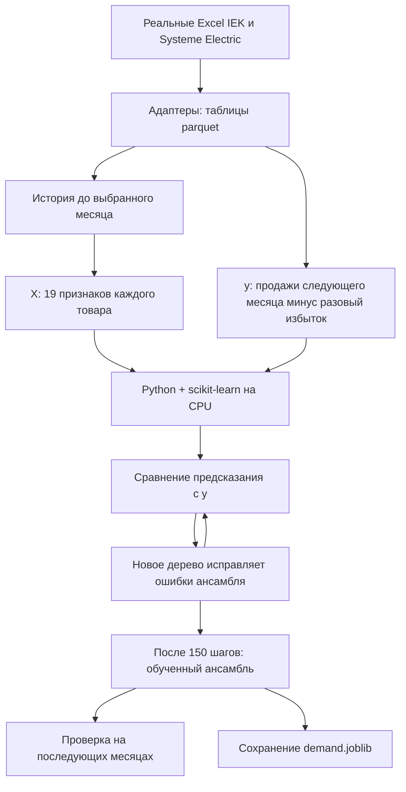
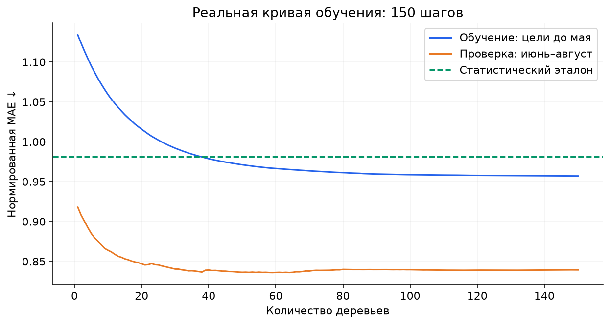
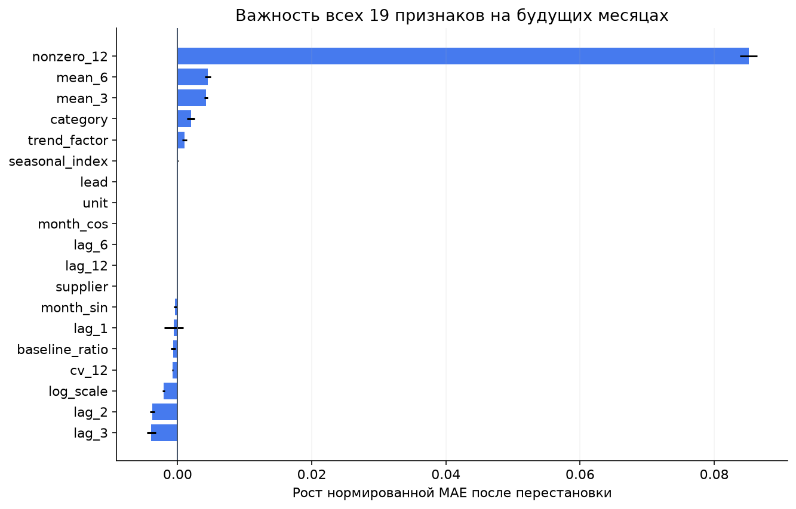
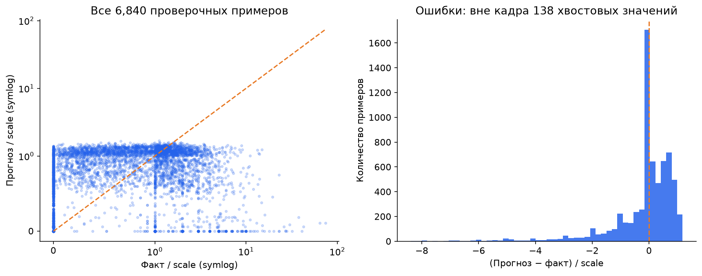
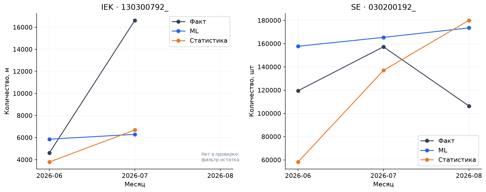
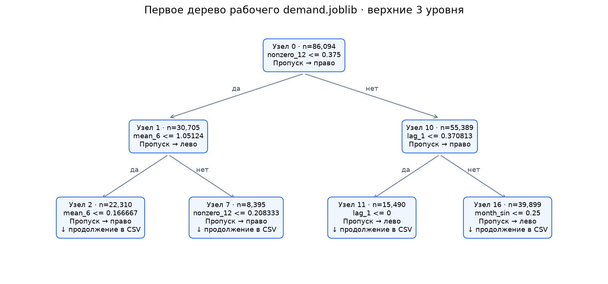

# Как AI-Dostar учится и делает прогноз

**Модель обучается локальным Python-процессом на CPU компьютера, где запущена команда.** Здесь это ваш компьютер с проектом в `C:\Hackathon`. scikit-learn строит небольшие деревья из таблицы прошлых продаж. Обучение запускается явно; открытие сайта загружает готовый файл и рассчитывает прогноз. GPT API для этого не нужен.

Открыть результат: **[Jupyter notebook с выполненными ячейками](../notebooks/01_demand_model_walkthrough.ipynb)** · **[готовая HTML-страница](../notebooks/01_demand_model_walkthrough.html)** · **[измеренное время обучения и CPU](assets/ml/run-summary.md)**. HTML можно открыть локально двойным щелчком; на GitHub удобнее смотреть notebook или эту страницу.

## Кто что делает и где лежат файлы

| Часть | Что делает | Где посмотреть |
|---|---|---|
| Исходные данные | Реальные выгрузки IEK и Systeme Electric | [Адаптеры Excel](../app/adapters/), локальная `data/clean/` после сборки |
| Подготовка | Очищает историю отдельно на каждом временном срезе, создаёт признаки `X` и цели `y` | [`snapshot`, `features`, `training_panel`](../app/ml/model.py) |
| Обучение | На CPU подбирает условия и значения листьев 150 деревьев | [`fit_model`, `train`](../app/ml/model.py), [команда обучения](../app/ml/train.py) |
| Сохранённая модель | Численные параметры и деревья, которые использует сайт | [`data/models/demand.joblib`](../data/models/demand.joblib), локальный файл, исключён из Git |
| Прогноз | Загружает модель, вычисляет продажи будущих месяцев | [`predict`, `forecast_horizon`](../app/ml/model.py) |
| Заказ | Учитывает прогноз, остатки, поставки и кратность упаковки | [pipeline](../app/pipeline.py), [пополнение](../app/engine/replenish.py) |
| Интерфейс | Показывает расчёт и позволяет утвердить заказ | [Streamlit](../app/ui/app.py) |
| Текстовый копилот | По отдельному запросу объясняет рассчитанные числа; при наличии ключа обращается к API | [copilot.py](../app/copilot.py) |
| Jupyter | Позволяет выполнить и изучить расчёт по ячейкам | [notebook](../notebooks/01_demand_model_walkthrough.ipynb), [читаемый исходник](../notebooks/01_demand_model_walkthrough.py) |

Если сайт перенести на сервер, Python, модель и её вычисления будут работать на CPU этого сервера. Браузер показывает результат. Для переобучения там потребуется отдельно запустить команду обучения с данными.

## Что происходит во время обучения



Слово «учитель» здесь означает наличие правильных ответов в истории: мы уже знаем, сколько продали в следующем месяце. «Ученик» — модель, которая подбирает зависимость между признаками и этим ответом. Например, на входе продажи за последние месяцы, сезон и категория товара; ответ — регулярные продажи будущего месяца. Ответ делится на прошлый масштаб товара, чтобы модель могла совместно учиться на больших и маленьких объёмах.

Разбиения дерева выбирает алгоритм обучения. При прогнозе он проходит по условиям каждого дерева до листа, складывает поправки и возвращает количество. Отдельный GPT не проверяет ответы и не обучает деревья. Этот процесс называется обучением с учителем (*supervised learning*).

Почему быстро: здесь 86 094 обучающих примера, 19 признаков и 150 небольших деревьев. Histogram-based boosting группирует числовые признаки в интервалы и эффективно ищет разбиения. Это вычислительная задача, посильная CPU. Параметры алгоритма описаны в [официальной документации scikit-learn](https://scikit-learn.org/stable/modules/generated/sklearn.ensemble.HistGradientBoostingRegressor.html).

**[Фактический замер](assets/ml/run-summary.md)** отдельно показывает подготовку данных, wall-time полного `fit`, CPU-seconds и память процесса. Это новый запуск на этом компьютере; старое время обучения мы задним числом не выдумываем. Лимит вычислительных потоков — 4, фактическая загрузка меняется по этапам. Память после обучения — память всего Python-процесса, не пик самой модели.

## Где проверка, чтобы модель не подсматривала будущее


В notebook обучающая выборка — 65 513 строк, проверочная — 6 840. Это примеры «товар × момент прогноза × горизонт», не 65 тысяч разных товаров. После проверки отдельно повторяется полное обучение на 86 094 примерах по август и сверяется с рабочим артефактом на 1 000 фиксированных примерах. Рабочий файл не перезаписывается.

Полная августовская модель не используется для объявления качества на июне–августе: она уже видела их в обучении. Проверка ниже — исторический backtest; эти периоды уже изучались при разработке, поэтому это не новый независимый внешний тест.

## Как менялась ошибка



Синяя линия — ошибка на обучении, оранжевая — на следующих месяцах. Пунктир — статистический эталон. Ниже лучше. Значения получены после каждого из 150 деревьев через `staged_predict`. Метрика — среднее `abs(прогноз − факт) / scale`, где `scale` известен из прошлого; это безразмерная ошибка, не «процент точности». Проверочная ошибка здесь ниже обучающей: состав товаров, месяцы и распределение целей у выборок различаются.

[Числа всех 150 шагов](assets/ml/learning_curve.csv) · [метрики и параметры запуска](assets/ml/diagnostics.json).

## На что модель опирается



На проверочной выборке перемешиваем один признак и смотрим, насколько выросла ошибка. Чем больше рост, тем сильнее модель опиралась на этот признак. Лаги и средние связаны между собой, поэтому значимость отдельного столбца не означает причинное влияние на спрос. Усы показывают разброс трёх перестановок.

| Признак | Значение |
|---|---|
| `supplier`, `category`, `unit` | Поставщик, группа товара, единица количества |
| `log_scale` | Логарифм `1 + scale`, отражает масштаб продаж товара |
| `lag_1/2/3/6/12` | Продажи соответствующее число месяцев назад, делённые на `scale` |
| `mean_3`, `mean_6` | Средние за 3/6 месяцев, делённые на `scale` |
| `nonzero_12` | Доля последних 12 месяцев с ненулевыми продажами |
| `cv_12` | Стандартное отклонение месячных продаж, делённое на `scale` |
| `baseline_ratio` | Статистический прогноз, делённый на `scale` |
| `seasonal_index`, `trend_factor` | Сезонность и тренд, рассчитанные из доступной истории |
| `month_sin`, `month_cos` | Два числа, кодирующие циклическое положение месяца в году |
| `lead` | Через сколько месяцев нужен прогноз: 1, 2 или 3 |

[Полная таблица важности](assets/ml/feature_importance.csv).

## Попадает ли прогноз в реальные продажи



Слева все 6 840 проверочных примеров; диагональ соответствует идеальному прогнозу. Масштаб осей `symlog` позволяет одновременно видеть нули и крупные значения. Справа распределение ошибки: отрицательная означает недопрогноз. Для читаемости гистограммы скрыты крайние 1% с каждой стороны, число скрытых точек подписано. В CSV сохранены все значения.



Два заранее выбранных товара из демо показаны в их собственных единицах. Горизонт — три месяца; август IEK не проходит фильтр положительного начального остатка, поэтому отмечен пропуском. Линии не являются доверительными интервалами. «Факт» — продажи за вычетом обнаруженного разового избытка. [Все проверочные предсказания](assets/ml/holdout_predictions.csv).

Наблюдаемые продажи ограничены наличием товара. Положительный остаток в начале месяца не доказывает отсутствие дефицита в течение месяца. В общей проверке по трём срезам нормированная ошибка снизилась на 16.41%, но для IEK в штуках WAPE вырос с 33.72% до 35.93%. Это разные метрики; улучшение одной не гарантирует лучший закупочный результат. Подробности — [методика](methodology-ml.md) и [общий отчёт](ml-evaluation.json).

## Где ноды



Это верхние три уровня первого дерева из настоящего `demand.joblib`. Условие ведёт влево, если ответ «да», и вправо, если «нет»; маршрут пропуска подписан отдельно. `n` — число обучающих примеров, дошедших до узла. Условия с `mean_6` и другими объёмными признаками относятся к нормированным значениям из таблицы выше.

Все **4 350 узлов**, включая **2 250 листьев**, находятся в **[CSV структуры 150 деревьев](assets/ml/production_tree_nodes.csv)**. `tree` и `node` — номера с нуля; `left/right` — номера дочерних узлов, `condition` — условие. `value` в листе — добавка к нормированному прогнозу с уже учтённым learning rate. У внутренних узлов это служебное значение, не конечный прогноз. Формат внутренних структур зависит от версии scikit-learn, версия записана в JSON запуска.

Это узлы деревьев в памяти Python и в файле модели. Отдельных сетевых узлов или серверов для них не создаётся.

## Где Gym и Jupyter

**Jupyter создан:** [исполненный notebook](../notebooks/01_demand_model_walkthrough.ipynb). В нём код, выводы, замеры и реальные графики. До этой работы обучение выполнялось из Python-модуля; notebook не был необходим для работы `.fit()`.

**Gym здесь не используется.** Gymnasium предоставляет среды, в которых агент выбирает действия, получает наблюдения и награды. Наш текущий прогноз обучается по историческим парам `X/y`; среды действий и наград в нём нет. [Официальное описание Gymnasium](https://gymnasium.farama.org/introduction/basic_usage/).

Gym мог бы понадобиться для отдельной задачи: обучать политику закупок в симуляторе склада с затратами на хранение, дефицит и поставки. Это другой компонент, требующий проверяемого симулятора и данных о стоимости. Выдуманный симулятор не улучшил бы достоверность нынешнего прогноза.

## Как повторить на Windows

Из корня репозитория:

```powershell
# Дополнительные зависимости для анализа
.venv\Scripts\python.exe -m pip install -r requirements-notebooks.txt

# Если ещё нет data/clean и data/models/demand.joblib:
.venv\Scripts\python.exe -m app.adapters.build
.venv\Scripts\python.exe -m app.ml.train

# Выполнить notebook целиком, обновить PNG/CSV/JSON и HTML
.venv\Scripts\python.exe scripts/run_ml_notebook.py

# Открыть Jupyter для интерактивной работы (локально)
.venv\Scripts\python.exe -m jupyterlab notebooks/01_demand_model_walkthrough.ipynb --ServerApp.ip=127.0.0.1

# Или сразу открыть готовую HTML-страницу
Start-Process notebooks/01_demand_model_walkthrough.html
```

Исходные Excel должны быть доступны адаптерам; пути и сборка описаны в [README](../README.md). Числа в опубликованных графиках относятся к данным, чей SHA256 указан в [diagnostics.json](assets/ml/diagnostics.json). На других данных результаты изменятся.

Редактируемый источник notebook — [`.py` с границами ячеек](../notebooks/01_demand_model_walkthrough.py). Скрипт сборки заново создаёт `.ipynb` из него, поэтому постоянные изменения переносите в `.py`. Ядро `AI-Dostar (.venv)` регистрируется внутри виртуального окружения. Модель и parquet остаются локальными; в Git хранятся код, выполненный notebook и диагностические результаты.
