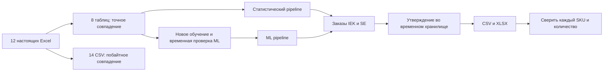

# Проверка AI-Dostar на реальных данных — 2026-09-23

Этот отчёт фиксирует прогон ветки с `130bf37`. Позднее объединён `main` до `5c5b3cc` и собран Linux-образ; актуальная проверка контейнера описана в [Docker](docker.md). В новом ассистенте LLM выбирает данные, текст ответа формируется шаблоном; ограничения старой проверки свободного текста ниже относятся к прежней версии.

**Проверены подготовка данных, оба метода прогноза, обучение, заказы, сохранение, экспорт, ассистент, браузер и notebook.** Итоговая ветка включает обновления `main` до `130bf37`: новый README, жизненный цикл ассортимента и свободные вопросы ассистенту. Внешний GPT API не проверен: ключ не настроен. Этот отчёт подтверждает перечисленные сценарии, а не отсутствие любых возможных ошибок.

Сайт на этой машине: **http://127.0.0.1:8501**. Это локальный адрес, не публичное развёртывание.

## Результаты и доказательства

| Система | Что подтверждено | Доказательство |
|---|---|---|
| Excel → данные | Все 8 заново построенных таблиц совпали с рабочими по значениям, типам, колонкам и порядку строк | [JSON полного цикла](verification/real-system.json) |
| Excel → CSV | 12 книг дали 14 CSV: IEK 6, SE 8; побайтное совпадение с сохранёнными CSV | [Лог](verification/real-system.txt) |
| Спрос и статистика | Разовые продажи, повторяющийся опт, дефицит, сезонность, тренд и граничные даты | 21 тест спроса и 17 приёмочных: [JUnit](verification/pytest.xml) |
| ML | Новое обучение на 86 094 примерах по 2 523 товарам, выбор loss, три временных среза; все 2 698 прогнозов будущего месяца совпали с рабочей моделью | [Отчёт обучения](verification/real-system.json), 6 ML-тестов в [JUnit](verification/pytest.xml) |
| Pipeline | Оба метода обработали 248 875 строк накладных: 2 714 прогнозных строк, 2 482 строки заказа; проверены конечные неотрицательные числа и кратность | [Отчёт](verification/real-system.json) |
| Утверждение | Редактирование, обязательная причина, нулевая правка, сохранение и новая сессия | Реальный UI-сценарий и тесты продукта: [JUnit](verification/pytest.xml) |
| Экспорт | CSV/XLSX каждого поставщика в каждом методе перечитаны и сверены по SKU и количествам | [Отчёт](verification/real-system.json) |
| Ассистент | Рекомендации, вопросы по заказу, жизненный цикл, пары; отсутствие устаревшего ответа после правки/пересчёта; ошибки конфигурации и неподтверждённые числа | [JUnit](verification/pytest.xml), [скриншот](verification/ml-assistant-desktop.png) |
| Копилот | Шаблоны, проверка ответов, ошибки API и защита чисел; реальный API не вызывался | 27 тестов: [JUnit](verification/pytest.xml) |
| Браузер | Edge: статистика и ML, 6 вкладок, вопрос ассистенту и таблица оснований, карточка LOOP, desktop 1440×1000 и mobile 390×844; без ошибок JavaScript | [Статистика](verification/browser-statistical.txt), [ML](verification/browser-ml.txt), [мобильный экран](verification/ml-order-mobile.png) |
| Jupyter | Все 20 ячеек выполнены; 5 графиков в HTML доступны без сети; 36 локальных ссылок существуют | [Notebook](../notebooks/01_demand_model_walkthrough.ipynb), [сводка](verification/test-summary.json) |
| Зависимости | `python -m pip check`: `No broken requirements found` | Проверено в текущем `.venv` |

**Итог полного pytest: 119 passed, 0 failures, 0 errors, 0 skipped.** [Лог с временем](verification/pytest.txt) · [каждый тест и длительность](verification/pytest.xml) · [сводка по модулям](verification/test-summary.json). В JUnit сохранены статусы/названия/время, исключены имя компьютера и консольные выводы отдельных тестов.

Полный Excel/ML/экспортный цикл и notebook выполнены после объединения с `ddabe33`. Следующий коммит `130bf37` изменил ассистента; итоговый полный pytest и оба браузерных прогона повторены уже с ним и исправлениями. Код адаптеров, обучения и расчёта между этими проверками не менялся.

## Проверка до конечного файла заказа



| Метод | IEK: строк CSV / XLSX | SE: строк CSV / XLSX |
|---|---:|---:|
| Статистика | 678 / 678 | 163 / 163 |
| ML | 574 / 574 | 142 / 142 |

Экспорт содержит утверждённые положительные количества. Разное число строк между методами объясняется разными прогнозами; каждый файл сверялся со своим утверждённым заказом. Утверждения теста записывались в изолированную временную папку. Исходные Excel, рабочие parquet, модель и рабочие утверждения не изменены — их контрольные суммы проверены до и после.

[SHA256 модели и данных](verification/real-system.json) · [SHA256 проверенных исходных файлов](verification/source-sha256.json). Хеши исходников относятся к локальным байтам; смена окончаний строк при checkout может менять их без изменения кода.

## Исправления, найденные проверкой

- После изменения количества ассистент сохранял старые результаты. На первоначальном интерфейсе поиска баг воспроизведён падающим тестом. После перехода команды к свободным ответам защита адаптирована: при изменении заказа старый ответ скрывается, при пересчёте сбрасывается; новый API-запрос автоматически не выполняется. Регрессия проверена на настоящем UI и данных.
- Ошибка создания клиента/настройки LLM теперь приводит к ответу по правилам. Числа из вопроса пользователя сами по себе не подтверждают количество: числовая проверка опирается на факты расчёта. Оба случая закреплены тестами.
- Конвертер CSV по умолчанию искал `datasets` вне репозитория; теперь использует репозиторную папку. Все книги конвертированы на временных копиях и сверены с CSV.
- `localhost` попадал на старый Streamlit через IPv6. Старый процесс остановлен; оба итоговых браузерных прогона выполнены на свежем сервере `127.0.0.1:8501`. После обновления Python-модулей сервер следует перезапускать.
- Конфликты README и ассистента разрешены с сохранением новых функций команды и наших проверок актуальности данных.

## Что не подтверждается этим прогоном

**Живой GPT API:** ключ отсутствует. Проверены работа без ключа и обработка тестовых ответов/ошибок клиента. Это не доказывает доступность сервиса или работоспособность будущего ключа. Проверка чисел свободного ответа также не является доказательством правильной смысловой связи каждого утверждения с товаром; решение остаётся за менеджером.

Реальные остатки IEK, сроки поставок и ежедневная доступность товара не подтверждены исходниками. ML воспроизводит исторический backtest, а не гарантирует будущую точность: нормированная MAE 0.938907 → 0.784852, но у IEK/шт WAPE ухудшился. [Методика и ограничения](methodology-ml.md).

Публичный хостинг, многопроцессное хранилище и нагрузочная устойчивость не проверялись. End-to-end, browser и notebook работают на реальных данных; синтетические unit-тесты проверяют граничные случаи и не подменяют реальный pipeline.

## Повторный запуск

Из корня репозитория после установки зависимостей, подготовки данных и локальной модели:

```powershell
.venv\Scripts\python.exe -m pip check
.venv\Scripts\python.exe scripts/verify_real_system.py
.venv\Scripts\python.exe -m pytest -q --basetemp=.pytest_cache/system-latest --junitxml=.pytest_cache/system-latest.xml --tb=short

# В отдельном терминале, если сервер ещё не запущен:
.venv\Scripts\python.exe -m streamlit run app/ui/app.py --server.address=127.0.0.1 --server.port=8501

# Требуются Playwright и установленный Microsoft Edge:
.venv\Scripts\python.exe -m pip install playwright
.venv\Scripts\python.exe scripts/ui_browser_smoke.py --url http://127.0.0.1:8501
.venv\Scripts\python.exe scripts/ui_browser_smoke.py --ml --url http://127.0.0.1:8501

.venv\Scripts\python.exe -m pip install -r requirements-notebooks.txt
.venv\Scripts\python.exe scripts/run_ml_notebook.py
```

[`verify_real_system.py`](../scripts/verify_real_system.py) завершается ненулевым кодом при несовпадении данных, прогнозов, экспортов или изменении рабочих файлов; внешние API не вызывает. Установка — [README](../README.md), устройство ML — [визуальный разбор](ml-visual-guide.md).
